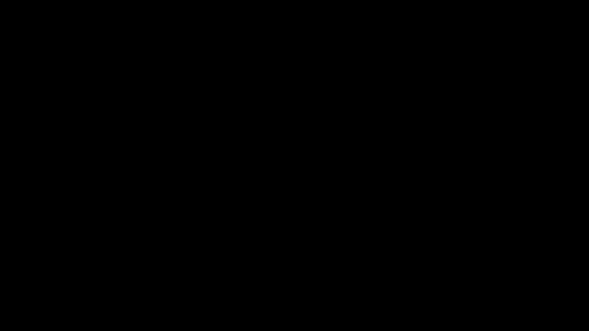

# Lidar-Obstacle-Detection

This project processes a stream of pointclouds. The following steps are done to track the objects moving in the pointcloud:

1. Load current PointCloud from the stream
2. Segment into ground plane and residual data (ransac)
3. Cluster Objects in the residual data (euclidean clustering + kdtree)
4. Define bounding boxes around each cluster

## Dependencies

A Dockerfile is provided under `.devcontainer/Dockerfile`. In Visual Studio Code this directory can be used to automatically setup a developement container. 
Dependecies: 
- CMake 3.4
- PCL 1.8
- OpenMP

## Profiling

This project implements profiling capabilities. For that it defines the two macros `PROFILE_FUNCTION()` and `PROFILE_SCOPE("name")`. 

- `PROFILE_FUNTION()`: Records the time required by a function and saved the data to ´profile/profile.json´ under the function name. 
- `PROFILE_SCOPE("name")`: This macro allows to record the time taken by random peaces of code. This can be done by encapsulating that code into its own scope. The data is saved to ´profile/profile.json´ under the passed name.

The output data is parsed in such a way, that chrome tracing tool can interpret it. To visualize the resulting profile, open the chrome tracing tool in the chrome browser under the following [link](chrome://tracing). Then load the profile.json file into the tool. 
